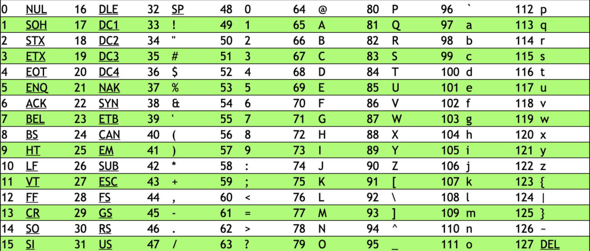

# Мысли по выполнению



'0' = 48

'9' = 57

## Способ 1

Если код символа в строке больше или равен 48 И меньше 57, то +1 (на следующий символ):

```cpp
if (line[i] >= '0' && line[i] < '9')
    line[i] += 1;
```

Если код символа равен 58, то присвоить код 48:

```cpp
if (line[i] == '9')
    line[i] = '0';
```

## Способ 2

Возможный вариант, используя модульную математику:
...
