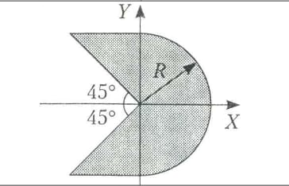

# Individual Tasks

## Задания варианта №8 с ресурсами

### [Task 1](1.cpp)

**Связанные:** [Блок-схема](1.pdf)

**Цель работы** - освоение простейшей структуры программы; приобретение
навыков в записи выражений на языке С++ и использовании стандартных функций;
получение навыков в организации ввода-вывода информации.

**Задание:** Вычислить значения переменных, указанных в таблице 1.1, по заданным расчетным формулам и наборам исходных данных. На печать вывести значения вводимых исходных данных и результат вычислений, сопровождая вывод наименованиями выводимых переменных.

**Формула:**

$$
m = \frac{-f(m_1 + m_2)}{(1-m_1^2 v^2)(1 + m_2^2 v^2)} + \frac{m_1 m_2 v^2}{m_1 + \frac{m_2}{m_1}}
$$

### [Task 2](2.cpp)

**Связанные:** [Блок-схема](2.pdf)

**Цель работы** - овладение практическими навыками разработки, программирования
вычислительного процесса разветвляющейся структуры; знакомство с задачами, для
решения которых используются операторы ветвления.

**Задание:** Определить, попадет ли точка с координатами (x, y) в ограниченную область, показанную на картинке ниже.

- Разработать математическую модель:
  - Определить исходные данные.
  - Определить результаты решения задачи.
  - Выписать математические формулы для перехода от исходных данных к результату.
- Составить и отладить программу:
  - Без использования разветвляющейся структуры.
  - С использованием условной операции.
  - С использованием оператора ветвления.

### [Task 3](3.cpp)

**Связанные:** [Блок-схема](3.pdf)

**Цель работы** - овладение практическими навыками разработки,
программирования циклического вычислительного процесса; освоение организации
циклов с известным числом повторений; получение навыков в выборе и использовании
операторов цикла.

**Задание:** Вычислить значения t, соответствующие каждому значению x ($x_n ≤ x ≤ x_k$, шаг изменения x равен dx) по формуле

$$
t = \frac{\sqrt{a + x}}{\cos(b + x) + 10} \cdot \sin(a + x^3)
$$

Вычислить количество отрицательных значений x. Определить максимальное значение среди вычисленных значений t. Контрольный расчет провести при $a=6.13, b=3.22, x_n=2, x_k=7, dx=0.5$. На экран вывести каждую вторую пару значений x и t.

### [Task 4](4.cpp)

**Связанные:** [Блок-схема](4.pdf), [Защита](4_defense.cpp)

**Цель работы** - овладение практическими навыками работы с массивами,
особенностями их ввода и вывода; приобретение дальнейших навыков по организации
программ циклической структуры с использованием приемов программирования.

**Задание:** Если в массиве А(n) есть хотя бы один элемент, меньший, чем –2, то все
отрицательные элементы заменить их модулем, оставив остальные без изменений; в
противном случае домножить все элементы на 0.1.

*Обработать массив. Вывести на печать
исходный массив и результаты.*

### [Task 5](5.cpp)

**Связанные:** [Блок-схема](5.pdf), [Защита](4_defense.cpp)

**Цель работы** - овладение навыками алгоритмизации и программирования структур
с вложенными циклами, навыками использования приемов программирования во
вложенных циклах; освоение способов описания, ввода и вывода матриц.

**Задание:** Задана матрица A(n,n). Зеркально отразить ее
относительно главной диагонали. В
преобразованной матрице найти строки,
элементы которой образуют возрастающую
последовательность.

*Обработать матрицу.
Вывести на печать результаты и исходную матрицу в общепринятом виде.*

### Task 7 [Char](7_char.cpp), [String](7_string.cpp)

**Связанные:** [Блок-схема](5.pdf)

**Цель работы** - получение практических навыков в организации ввода-вывода строк,
их обработки, в использовании встроенных процедур и функций работы со строками.

**Задание:** Все слова с четными номерами переписать в новую строку.

*Обработать строку. Выполнить задание в 2-х
вариантах: с использованием встроенного типа и с использованием класса string.*

### [Task 8](8.cpp)

**Связанные:** [Блок-схема](8.pdf), [Защита](8_defense.cpp)

**Цель работы** - овладение навыками написания подпрограмм-функций и обращения к ним.

**Задание:** В заданном количестве строк исключить символы с кодом больше заданного числа.

*Для ввода, вывода массива и выполнения варианта задания использовать функции.*

### [Task 9](9.cpp)

**Связанные:** [Блок-схема](9.pdf)

**Цель работы** – изучение способов выделения последовательности символов из строк файла для
последующей обработки.

**Задание:** Среди всех слов файла найти слова, представляющие собой целые числа. Увеличить все эти числа на
1.

### [Task 10](10.cpp)

**Связанные:** [Блок-схема](10.pdf), [Защита](10_defense.cpp)

**Цель работы** - получение практических навыков по написанию и отладке программ сортировки
массивов структур.

**Задание:** Создать файл с полями: фамилия, сумма долга, номер ЖЭКа. Вывести список должников.
Определить сумму задолженностей по каждому ЖЭКу.

*Заготовить файл (количество структур в файле должно быть не менее 10), а затем выполнить
обработку этого файла в соответствии с заданием.*

### [Task 11](11.cpp)

**Связанные:** [Блок-схема](11.pdf), [Защита](11_defense.cpp)

**Цель работы** – изучить основные алгоритмы поиска, овладеть практическими навыками разработки, программирования и применения алгоритмов поиска.

**Задание:**
| № вар. | Тип и размер массива | Линейный поиск       | Двоичный поиск (классический алгоритм) | Двоичный поиск (метод интерполяции) |
|--------|----------------------|----------------------|----------------------------------------|-------------------------------------|
| 8      | целые числа С(25)    | последнее вхождение  | -                                      | первое вхождение                    |

*Выполнить поиск заданного значения в массиве, используя линейный и бинарный алгоритмы поиска в соответствии с вариантом.*

### [Task 12](12.cpp)

**Связанные:** [Блок-схема](12.pdf)

**Цель работы** – изучить основные алгоритмы сортировки, овладеть
практическими навыками разработки, программирования и применения алгоритмов
сортировки.

**Задание:**
| № вар. | Тип и размер массива | Алгоритм сортировки | вставкой | выбором | обменом | Шейкер-сортировка | сортировка Шелла |
|--------|----------------------|---------------------|----------|---------|---------|-------------------|------------------|
| 8      | целые числа С(25)    |                     | 3        | -       | 6       | -                 | -                |

*Выполнить сортировку массива, используя алгоритмы в соответствии с вариантом.*

Где:

- 1- сортировка первой половины массива;
- 2- сортировка элементов массива, расположенных за максимальным элементом;
- 3- сортировка второй половины массива;
- 4- сортировка элементов массива, расположенных за минимальным элементом;
- 5- сортировка всего массива;
- 6- сортировка элементов массива, расположенных перед максимальным
элементом;
- 7- сортировка элементов массива, расположенных перед минимальным
элементом;

### [Task 13](13.cpp)

**Связанные:** [Блок-схема](13.pdf), [Защита](13_defense.cpp)

**Цель работы** - получить практические навыки работы с
переменными ссылочного типа и динамическими переменными; освоить
различные способы организации, формирования и обработки списков.

**Задание:** Для натурального $N$ и действительных $A_1, \ldots, A_{2n}$ получить $A_1 \cdot A_{2n} + A_2 \cdot A_{2n-1} + \ldots + A_n \cdot A_{n+1}$.

*Ввести элементы списка и выполнить указанные действия.*

## **Изменили вариант с №8 на №7**

### [Task 14](14.cpp)

**Цель работы** - получить практические навыки работы с переменными
ссылочного типа и динамическими переменными; освоить различные способы
организации, формирования и обработки двунаправленных списков.

**Задание:** Исключить  из списка  слова, сумма кодов символов которых кратна заданному числу.

*Сформировать двунаправленный список символов, заканчивая
ввод точкой. Слова в этом списке разделены пробелами. Выполнить
указанные действия.*
