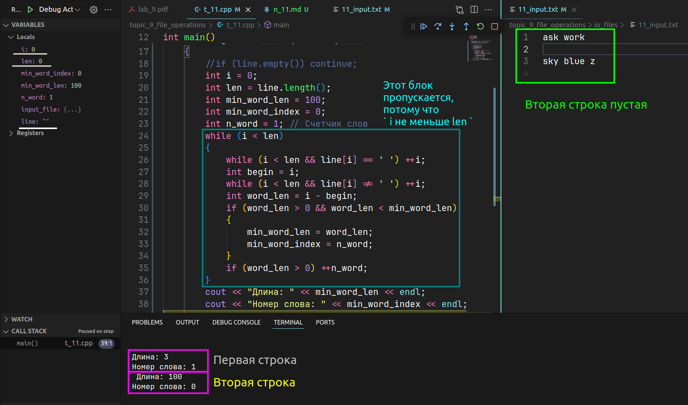
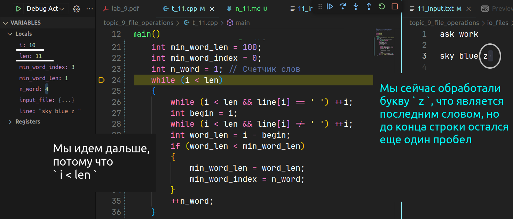
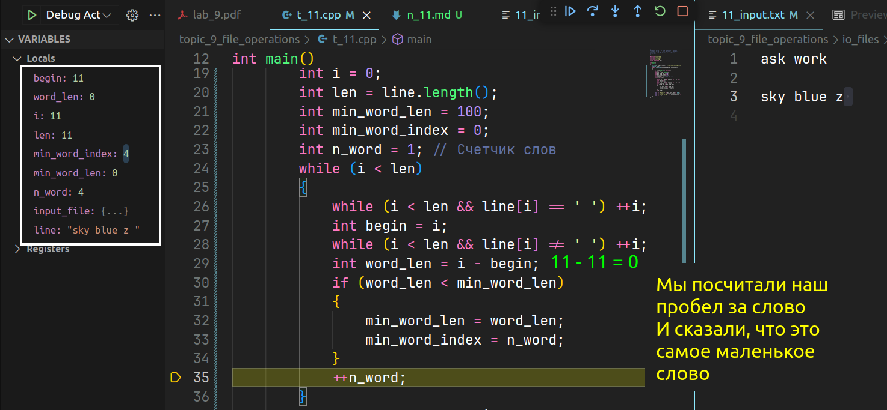

# Объяснение выполнения

## Обработка пустых строк

Конструкция:

```cpp
if (line.empty()) continue;
```

*Аналогично можно записать `if (i == len) continue;`.*

Проверка на пустую строку с помощью метода `empty()` класса `std::string`. Если строка пуста, оператор continue пропускает её обработку и переходит к следующей итерации цикла `while`. Это предотвращает некорректный вывод значений для пустых строк.



## Обновление самого короткого слова и увеличение счетчика слов

```cpp
if (word_len > 0 && word_len < min_word_len) 
{
    min_word_len = word_len;
    min_word_index = n_word;
}
if (word_len > 0) ++n_word;
```

## Тут нас интересует 2 момента

1. **Зачем тут проверка на длину слова > 0**
    - Объяснение: Эта проверка необходима, чтобы исключить пустые слова `word_len > 0` гарантирует, что мы рассматриваем только те участки строки, которые действительно содержат слова. Это предотвращает некорректное увеличение счетчика слов (`n_word`) и выбор пустых слов как самых коротких слов.

    
    

2. **Условие `word_len < min_word_len`**
    - **Объяснение:** Это условие проверяет, является ли текущее слово короче, чем уже найденное самое короткое слово. Переменная `min_word_len` инициализируется значением 100 (или `INT_MAX` для большей надежности), чтобы любое первое реальное слово в строке автоматически стало самым коротким, после чего `min_word_len` будет обновляться при нахождении более коротких слов.
