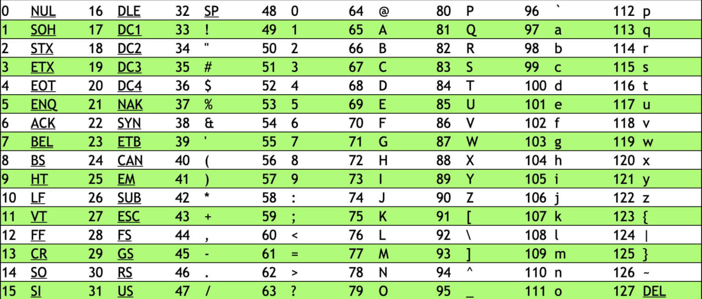
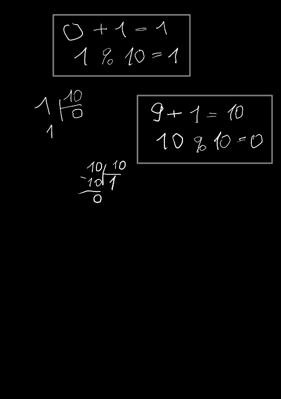

# Мысли по выполнению



'0' = 48

'9' = 57

## Способ 1

Если код символа больше или равен 48 И меньше 57, то +1 (на следующий символ):

```cpp
if (ch >= '0' && ch < '9')
    ch += 1;
```

Если код символа равен 58, то присвоить код 48:

```cpp
if (ch == '9')
    ch = '0';
```

## Способ 2

Используя модульную математику.

Представляем круг "цикл".

Как и в случае с настенными часами, где после 23:00 идет 0:00, мы можем представить последовательность цифр от 0 до 9 как круг, где после 9 следует 0. Это основа модульной математики, где мы работаем с ограниченным набором значений, и каждое следующее значение "заворачивается" обратно к началу после достижения определенного предела — в нашем случае, это 10.

Таким образом, когда мы прибавляем 1 к цифре 9, мы не переходим к 10, а возвращаемся к 0. Это можно представить следующим образом:

```code
9 + 1 = 10
10 % 10 = 0
```

Так как 10 делится на 10 без остатка, мы получаем 0 — это и есть "сброс" к началу нашего круга цифр.

Теперь, если мы хотим увеличить каждую цифру в строке на 1 с учетом этой "цикличности", мы можем использовать следующий код:

```cpp
ch = (ch - '0' + 1) % 10 + '0';
```

Здесь ch - '0' преобразует символ цифры в его числовой эквивалент (например, '2' становится 2). Затем мы прибавляем 1, чтобы увеличить значение, и применяем операцию модуля 10, чтобы обеспечить "сброс" к 0, если значение достигло 10. В конце мы снова прибавляем '0', чтобы преобразовать числовое значение обратно в символ цифры.

Такой подход позволяет нам корректно обрабатывать переход через "конец" диапазона цифр и начинать сначала, не беспокоясь о проверке граничных условий и без необходимости использовать условные операторы для проверки каждого отдельного случая.


